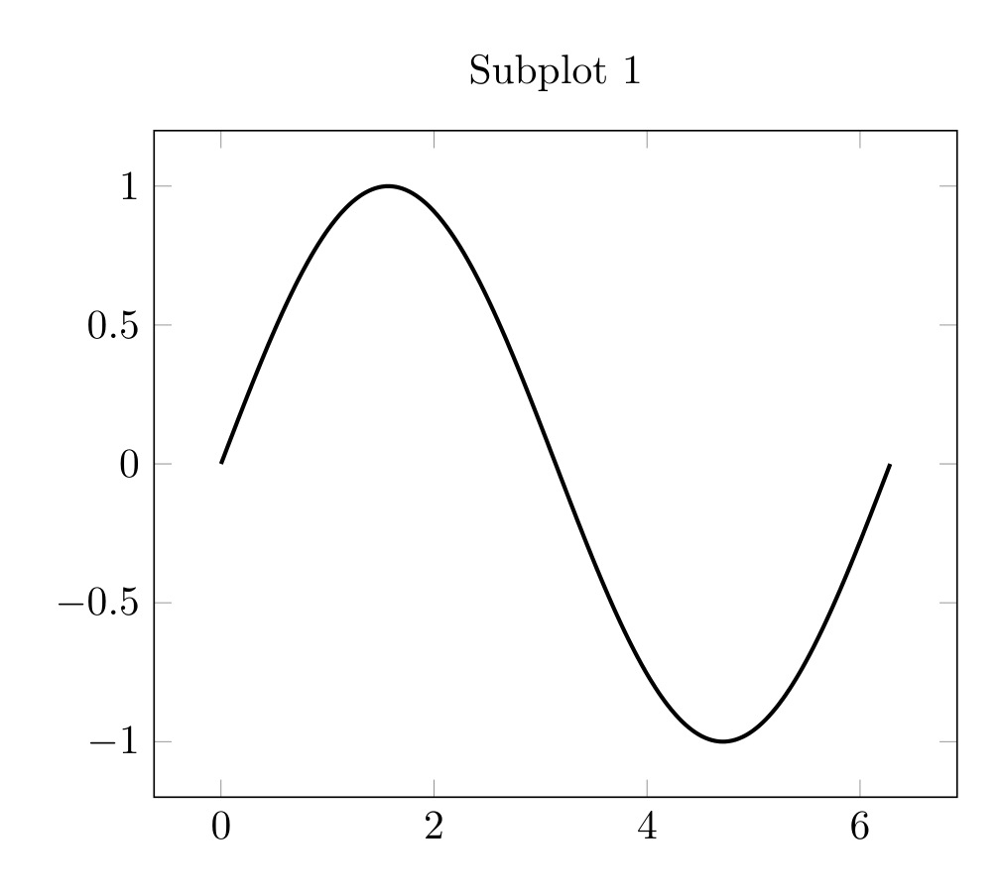
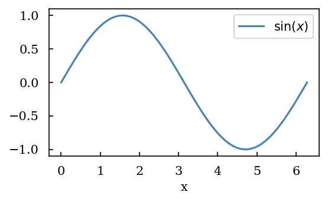

# Maxlotlib


# Maxplotlib

A clean, expressive wrapper around **Matplotlib**, **Plotly**,
**plotext**, and **tikzfigure** for producing publication-quality
figures with minimal boilerplate. Swap backends without rewriting your
data — render the same canvas as a crisp PNG, an interactive Plotly
chart, a terminal-native plotext figure, or camera-ready **TikZ** code
for LaTeX.

## Install

``` bash
pip install maxplotlibx
```

## Showcase

### Quickstart

<div id="fig-showcase-1">

``` python
import numpy as np
from maxplotlib import Canvas

x = np.linspace(0, 2 * np.pi, 200)
y = np.sin(x)

canvas, ax = Canvas.subplots()
ax.plot(x, y)
```

Figure 1

</div>

Plot the figure with the default (matplotlib) backend:

``` python
canvas.show()
```


For Matplotlib-specific customization, pass method calls declaratively.
Figure methods run once and axes methods run for every subplot,
providing access to any Matplotlib API without requiring a maxplotlib
wrapper:

``` python
canvas.plot(matplotlib_customizations={
    "figure": {
        "suptitle": "My figure",
    },
    "axes": {
        "tick_params": {
            "axis": "both",
            "which": "major",
            "length": 6,
        },
    },
})
```

For dynamic customization, the same option also accepts a function:

``` python
def customize(fig, axes):
    fig.suptitle("My figure")
    for ax in axes.flat:
        ax.tick_params(axis="both", which="major", length=6)

canvas.plot(matplotlib_customizations=customize)
```

Render the same line graph directly in the terminal with the `plotext`
backend:

``` python
terminal_fig = canvas.plot(backend="plotext")
print(terminal_fig.build(keep_colors=False))
```

         ┌─────────────────────────────────────────────────────────────────────────┐
     1.00┤             ▗▄▟▀▀▀▀▀▙▄                                                  │
         │           ▄▞▘         ▀▚▖                                               │
         │         ▄▛              ▝▚▖                                             │
     0.67┤       ▗▞                  ▝▚▖                                           │
         │      ▄▀                     ▀▖                                          │
         │    ▗▞▘                       ▝▚                                         │
     0.33┤   ▗▀                           ▀▖                                       │
         │  ▞▘                             ▀▖                                      │
         │▗▞▘                               ▝▚                                     │
     0.00┤▀                                  ▝▚▖                                  ▞│
         │                                     ▚▖                               ▗▞▘│
         │                                      ▝▄                             ▗▞  │
    -0.33┤                                       ▝▄                           ▄▘   │
         │                                         ▚▖                       ▗▞▘    │
         │                                          ▝▄                     ▄▀      │
    -0.67┤                                           ▝▚▖                  ▞▘       │
         │                                             ▝▚▖              ▟▀         │
         │                                               ▝▚▄         ▗▞▀           │
    -1.00┤                                                  ▀▜▄▄▄▄▄▛▀▘             │
         └┬─────────────────┬─────────────────┬─────────────────┬─────────────────┬┘
         0.0               1.6               3.1               4.7              6.3 

Or plot with the TikZ backend:

``` python
canvas.show(backend="tikzfigure")
```



    \begin{tikzpicture}
        \begin{groupplot}[group style={group size=1 by 1, horizontal sep=1.5cm}]
                \nextgroupplot[grid=none, title=Subplot 1]
                \addplot[color=black, line width=1.0] coordinates {(0.0,0.0) (0.03157379551346526,0.03156854976481053) (0.06314759102693052,0.06310563131267365) (0.09472138654039577,0.09457980779484494) (0.12629518205386103,0.12595970506771756) (0.1578689775673263,0.15721404296725078) (0.18944277308079155,0.18831166648971787) (0.2210165685942568,0.21922157684769134) (0.25259036410772207,0.24991296237030836) (0.28416415962118735,0.28035522921701445) (0.3157379551346526,0.3105180318741688) (0.3473117506481178,0.3403713034041128) (0.3788855461615831,0.3698852854165468) (0.4104593416750484,0.399030557732341) (0.4420331371885136,0.4277780677102096) (0.47360693270197884,0.45609915920701594) (0.5051807282154441,0.48396560114283876) (0.5367545237289094,0.5113496156423267) (0.5683283192423747,0.5382239057242886) (0.5999021147558399,0.5645616825119181) (0.6314759102693052,0.5903366919365284) (0.6630497057827704,0.6155232409081792) (0.6946235012962356,0.6400962229271071) (0.7261972968097009,0.6640311431104312) (0.7577710923231662,0.6873041426091843) (0.7893448878366315,0.7098920223913329) (0.8209186833500968,0.7317722663670768) (0.8524924788635619,0.752923063833377) (0.8840662743770272,0.773323331215339) (0.9156400698904925,0.7929527330827786) (0.9472138654039577,0.8117917024210207) (0.978787660917423,0.8298214601357258) (1.0103614564308883,0.8470240337722988) (1.0419352519443534,0.8633822754312233) (1.0735090474578188,0.8788798788614604) (1.105082842971284,0.8935013957148741) (1.1366566384847494,0.9072322509454814) (1.1682304339982146,0.9200587573381745) (1.1998042295116798,0.9319681291524348) (1.2313780250251452,0.942948494867437) (1.2629518205386103,0.9529889090158392) (1.2945256160520755,0.9620793630944628) (1.326099411565541,0.9702107955409863) (1.357673207079006,0.9773751007667072) (1.3892470025924712,0.9835651372363698) (1.4208207981059366,0.9887747345870026) (1.4523945936194018,0.9929986997786696) (1.4839683891328672,0.9962328222710067) (1.5155421846463324,0.9984738782203788) (1.5471159801597976,0.9997196336934779) (1.578689775673263,0.9999688468941563) (1.6102635711867281,0.9992212694012756) (1.6418373667001935,0.9974776464163387) (1.6734111622136587,0.9947397160206569) (1.7049849577271239,0.9910102074427921) (1.7365587532405893,0.9862928383380027) (1.7681325487540545,0.9805923110824041) (1.7997063442675196,0.9739143080855378) (1.831280139780985,0.9662654861260218) (1.8628539352944502,0.9576534697159296) (1.8944277308079154,0.9480868435005095) (1.9260015263213808,0.9375751437008251) (1.957575321834846,0.9261288486078413) (1.9891491173483113,0.9137593681374367) (2.0207229128617765,0.9004790324567516) (2.0522967083752417,0.8863010796932087) (2.083870503888707,0.8712396427384597) (2.1154442994021725,0.8553097351604118) (2.1470180949156377,0.8385272362373773) (2.178591890429103,0.8209088751292626) (2.210165685942568,0.802472214201578) (2.241739481456033,0.7832356315188905) (2.273313276969499,0.7632183025251684) (2.304887072482964,0.7424401809292831) (2.336460867996429,0.7209219788147164) (2.3680346635098943,0.6986851459933066) (2.3996084590233595,0.6757518486236088) (2.4311822545368247,0.6521449471151868) (2.4627560500502903,0.6278879733408583) (2.4943298455637555,0.6030051071796145) (2.5259036410772207,0.5775211524135886) (2.557477436590686,0.5514615120031076) (2.589051232104151,0.5248521627644684) (2.6206250276176166,0.497719629475683) (2.652198823131082,0.47009095843600296) (2.683772618644547,0.44199369050557913) (2.715346414158012,0.4134558336521342) (2.7469202096714773,0.384505835032011) (2.7784940051849425,0.3551725526334286) (2.810067800698408,0.3254852265102116) (2.8416415962118733,0.29547344963467004) (2.8732153917253385,0.2651671383986787) (2.9047891872388036,0.23459650279236888) (2.936362982752269,0.20379201629015234) (2.9679367782657344,0.17278438547409944) (2.9995105737791996,0.14160451942495159) (3.031084369292665,0.11028349891127508) (3.06265816480613,0.0788525454074766) (3.094231960319595,0.047342989971558204) (3.1258057558330608,0.01578624201363682) (3.157379551346526,-0.015786242013637018) (3.188953346859991,-0.04734298997155796) (3.2205271423734563,-0.07885254540747635) (3.2521009378869215,-0.11028349891127483) (3.283674733400387,-0.14160451942495178) (3.3152485289138522,-0.17278438547409963) (3.3468223244273174,-0.20379201629015212) (3.3783961199407826,-0.23459650279236863) (3.4099699154542478,-0.2651671383986785) (3.441543710967713,-0.2954734496346698) (3.4731175064811786,-0.32548522651021183) (3.5046913019946437,-0.3551725526334284) (3.536265097508109,-0.38450583503201075) (3.567838893021574,-0.41345583365213395) (3.5994126885350393,-0.4419936905055789) (3.630986484048505,-0.4700909584360031) (3.66256027956197,-0.49771962947568316) (3.6941340750754352,-0.5248521627644683) (3.7257078705889004,-0.5514615120031073) (3.7572816661023656,-0.5775211524135885) (3.7888554616158308,-0.6030051071796143) (3.8204292571292964,-0.6278879733408584) (3.8520030526427615,-0.6521449471151866) (3.8835768481562267,-0.6757518486236087) (3.915150643669692,-0.6986851459933063) (3.946724439183157,-0.7209219788147162) (3.9782982346966227,-0.7424401809292832) (4.009872030210087,-0.7632183025251682) (4.041445825723553,-0.7832356315188903) (4.073019621237019,-0.8024722142015781) (4.104593416750483,-0.8209088751292625) (4.136167212263949,-0.8385272362373775) (4.167741007777414,-0.8553097351604116) (4.199314803290879,-0.8712396427384596) (4.230888598804345,-0.8863010796932088) (4.26246239431781,-0.9004790324567515) (4.294036189831275,-0.9137593681374367) (4.32560998534474,-0.9261288486078411) (4.357183780858206,-0.9375751437008251) (4.388757576371671,-0.9480868435005096) (4.420331371885136,-0.9576534697159295) (4.451905167398602,-0.9662654861260219) (4.483478962912066,-0.9739143080855377) (4.515052758425532,-0.9805923110824041) (4.546626553938998,-0.9862928383380027) (4.578200349452462,-0.9910102074427921) (4.609774144965928,-0.994739716020657) (4.641347940479393,-0.9974776464163387) (4.672921735992858,-0.9992212694012756) (4.704495531506323,-0.9999688468941563) (4.736069327019789,-0.9997196336934779) (4.767643122533254,-0.9984738782203788) (4.799216918046719,-0.9962328222710067) (4.830790713560185,-0.9929986997786696) (4.862364509073649,-0.9887747345870026) (4.893938304587115,-0.98356513723637) (4.925512100100581,-0.9773751007667072) (4.957085895614045,-0.9702107955409863) (4.988659691127511,-0.9620793630944628) (5.020233486640976,-0.9529889090158394) (5.051807282154441,-0.942948494867437) (5.083381077667907,-0.9319681291524348) (5.114954873181372,-0.9200587573381745) (5.146528668694837,-0.9072322509454813) (5.178102464208302,-0.8935013957148743) (5.209676259721768,-0.8788798788614604) (5.241250055235233,-0.8633822754312233) (5.272823850748698,-0.847024033772299) (5.304397646262164,-0.8298214601357258) (5.335971441775628,-0.8117917024210209) (5.367545237289094,-0.7929527330827786) (5.39911903280256,-0.7733233312153388) (5.430692828316024,-0.7529230638333771) (5.46226662382949,-0.7317722663670767) (5.493840419342955,-0.7098920223913331) (5.52541421485642,-0.6873041426091843) (5.556988010369885,-0.6640311431104317) (5.588561805883351,-0.6400962229271073) (5.620135601396816,-0.615523240908179) (5.651709396910281,-0.5903366919365287) (5.683283192423747,-0.5645616825119181) (5.714856987937211,-0.538223905724289) (5.746430783450677,-0.5113496156423268) (5.7780045789641425,-0.4839656011428386) (5.809578374477607,-0.45609915920701627) (5.841152169991073,-0.4277780677102096) (5.872725965504538,-0.3990305577323414) (5.904299761018003,-0.36988528541654697) (5.935873556531469,-0.34037130340411265) (5.967447352044934,-0.3105180318741691) (5.999021147558399,-0.28035522921701433) (6.030594943071864,-0.2499129623703088) (6.06216873858533,-0.21922157684769145) (6.093742534098795,-0.18831166648971762) (6.12531632961226,-0.15721404296725106) (6.1568901251257255,-0.12595970506771748) (6.18846392063919,-0.09457980779484539) (6.220037716152656,-0.06310563131267372) (6.2516115116661215,-0.031568549764810244) (6.283185307179586,-2.4492935982947064e-16)};

        \end{groupplot}
    \end{tikzpicture}

### Horizontal Subplots with TikZ Backend

The tikzfigure backend supports creating side-by-side subplots (1×n
layouts):

``` python
x = np.linspace(0, 2 * np.pi, 200)
canvas, (ax1, ax2) = Canvas.subplots(ncols=2, width="10cm", ratio=0.3)

ax1.plot(x, np.sin(x), color="royalblue")
ax1.set_title("sin(x)")

ax2.plot(x, np.cos(x), color="tomato")
ax2.set_title("cos(x)")

canvas.suptitle("Trigonometric Functions")
canvas.show(backend="tikzfigure")  # Generates LaTeX subfigures
```

<div id="fig-showcase-subplots">

<div class="cell-output cell-output-display">

<div id="fig-showcase-subplots-1">


(a)

</div>

</div>

<div id="fig-showcase-subplots-2">

    \begin{tikzpicture}
        \begin{groupplot}[group style={group size=2 by 1, horizontal sep=1.5cm}]
                \nextgroupplot[grid=none, width=4.25cm, height=3cm, title=sin(x)]
                \addplot[color=royalblue, line width=1.0] coordinates {(0.0,0.0) (0.03157379551346526,0.03156854976481053) (0.06314759102693052,0.06310563131267365) (0.09472138654039577,0.09457980779484494) (0.12629518205386103,0.12595970506771756) (0.1578689775673263,0.15721404296725078) (0.18944277308079155,0.18831166648971787) (0.2210165685942568,0.21922157684769134) (0.25259036410772207,0.24991296237030836) (0.28416415962118735,0.28035522921701445) (0.3157379551346526,0.3105180318741688) (0.3473117506481178,0.3403713034041128) (0.3788855461615831,0.3698852854165468) (0.4104593416750484,0.399030557732341) (0.4420331371885136,0.4277780677102096) (0.47360693270197884,0.45609915920701594) (0.5051807282154441,0.48396560114283876) (0.5367545237289094,0.5113496156423267) (0.5683283192423747,0.5382239057242886) (0.5999021147558399,0.5645616825119181) (0.6314759102693052,0.5903366919365284) (0.6630497057827704,0.6155232409081792) (0.6946235012962356,0.6400962229271071) (0.7261972968097009,0.6640311431104312) (0.7577710923231662,0.6873041426091843) (0.7893448878366315,0.7098920223913329) (0.8209186833500968,0.7317722663670768) (0.8524924788635619,0.752923063833377) (0.8840662743770272,0.773323331215339) (0.9156400698904925,0.7929527330827786) (0.9472138654039577,0.8117917024210207) (0.978787660917423,0.8298214601357258) (1.0103614564308883,0.8470240337722988) (1.0419352519443534,0.8633822754312233) (1.0735090474578188,0.8788798788614604) (1.105082842971284,0.8935013957148741) (1.1366566384847494,0.9072322509454814) (1.1682304339982146,0.9200587573381745) (1.1998042295116798,0.9319681291524348) (1.2313780250251452,0.942948494867437) (1.2629518205386103,0.9529889090158392) (1.2945256160520755,0.9620793630944628) (1.326099411565541,0.9702107955409863) (1.357673207079006,0.9773751007667072) (1.3892470025924712,0.9835651372363698) (1.4208207981059366,0.9887747345870026) (1.4523945936194018,0.9929986997786696) (1.4839683891328672,0.9962328222710067) (1.5155421846463324,0.9984738782203788) (1.5471159801597976,0.9997196336934779) (1.578689775673263,0.9999688468941563) (1.6102635711867281,0.9992212694012756) (1.6418373667001935,0.9974776464163387) (1.6734111622136587,0.9947397160206569) (1.7049849577271239,0.9910102074427921) (1.7365587532405893,0.9862928383380027) (1.7681325487540545,0.9805923110824041) (1.7997063442675196,0.9739143080855378) (1.831280139780985,0.9662654861260218) (1.8628539352944502,0.9576534697159296) (1.8944277308079154,0.9480868435005095) (1.9260015263213808,0.9375751437008251) (1.957575321834846,0.9261288486078413) (1.9891491173483113,0.9137593681374367) (2.0207229128617765,0.9004790324567516) (2.0522967083752417,0.8863010796932087) (2.083870503888707,0.8712396427384597) (2.1154442994021725,0.8553097351604118) (2.1470180949156377,0.8385272362373773) (2.178591890429103,0.8209088751292626) (2.210165685942568,0.802472214201578) (2.241739481456033,0.7832356315188905) (2.273313276969499,0.7632183025251684) (2.304887072482964,0.7424401809292831) (2.336460867996429,0.7209219788147164) (2.3680346635098943,0.6986851459933066) (2.3996084590233595,0.6757518486236088) (2.4311822545368247,0.6521449471151868) (2.4627560500502903,0.6278879733408583) (2.4943298455637555,0.6030051071796145) (2.5259036410772207,0.5775211524135886) (2.557477436590686,0.5514615120031076) (2.589051232104151,0.5248521627644684) (2.6206250276176166,0.497719629475683) (2.652198823131082,0.47009095843600296) (2.683772618644547,0.44199369050557913) (2.715346414158012,0.4134558336521342) (2.7469202096714773,0.384505835032011) (2.7784940051849425,0.3551725526334286) (2.810067800698408,0.3254852265102116) (2.8416415962118733,0.29547344963467004) (2.8732153917253385,0.2651671383986787) (2.9047891872388036,0.23459650279236888) (2.936362982752269,0.20379201629015234) (2.9679367782657344,0.17278438547409944) (2.9995105737791996,0.14160451942495159) (3.031084369292665,0.11028349891127508) (3.06265816480613,0.0788525454074766) (3.094231960319595,0.047342989971558204) (3.1258057558330608,0.01578624201363682) (3.157379551346526,-0.015786242013637018) (3.188953346859991,-0.04734298997155796) (3.2205271423734563,-0.07885254540747635) (3.2521009378869215,-0.11028349891127483) (3.283674733400387,-0.14160451942495178) (3.3152485289138522,-0.17278438547409963) (3.3468223244273174,-0.20379201629015212) (3.3783961199407826,-0.23459650279236863) (3.4099699154542478,-0.2651671383986785) (3.441543710967713,-0.2954734496346698) (3.4731175064811786,-0.32548522651021183) (3.5046913019946437,-0.3551725526334284) (3.536265097508109,-0.38450583503201075) (3.567838893021574,-0.41345583365213395) (3.5994126885350393,-0.4419936905055789) (3.630986484048505,-0.4700909584360031) (3.66256027956197,-0.49771962947568316) (3.6941340750754352,-0.5248521627644683) (3.7257078705889004,-0.5514615120031073) (3.7572816661023656,-0.5775211524135885) (3.7888554616158308,-0.6030051071796143) (3.8204292571292964,-0.6278879733408584) (3.8520030526427615,-0.6521449471151866) (3.8835768481562267,-0.6757518486236087) (3.915150643669692,-0.6986851459933063) (3.946724439183157,-0.7209219788147162) (3.9782982346966227,-0.7424401809292832) (4.009872030210087,-0.7632183025251682) (4.041445825723553,-0.7832356315188903) (4.073019621237019,-0.8024722142015781) (4.104593416750483,-0.8209088751292625) (4.136167212263949,-0.8385272362373775) (4.167741007777414,-0.8553097351604116) (4.199314803290879,-0.8712396427384596) (4.230888598804345,-0.8863010796932088) (4.26246239431781,-0.9004790324567515) (4.294036189831275,-0.9137593681374367) (4.32560998534474,-0.9261288486078411) (4.357183780858206,-0.9375751437008251) (4.388757576371671,-0.9480868435005096) (4.420331371885136,-0.9576534697159295) (4.451905167398602,-0.9662654861260219) (4.483478962912066,-0.9739143080855377) (4.515052758425532,-0.9805923110824041) (4.546626553938998,-0.9862928383380027) (4.578200349452462,-0.9910102074427921) (4.609774144965928,-0.994739716020657) (4.641347940479393,-0.9974776464163387) (4.672921735992858,-0.9992212694012756) (4.704495531506323,-0.9999688468941563) (4.736069327019789,-0.9997196336934779) (4.767643122533254,-0.9984738782203788) (4.799216918046719,-0.9962328222710067) (4.830790713560185,-0.9929986997786696) (4.862364509073649,-0.9887747345870026) (4.893938304587115,-0.98356513723637) (4.925512100100581,-0.9773751007667072) (4.957085895614045,-0.9702107955409863) (4.988659691127511,-0.9620793630944628) (5.020233486640976,-0.9529889090158394) (5.051807282154441,-0.942948494867437) (5.083381077667907,-0.9319681291524348) (5.114954873181372,-0.9200587573381745) (5.146528668694837,-0.9072322509454813) (5.178102464208302,-0.8935013957148743) (5.209676259721768,-0.8788798788614604) (5.241250055235233,-0.8633822754312233) (5.272823850748698,-0.847024033772299) (5.304397646262164,-0.8298214601357258) (5.335971441775628,-0.8117917024210209) (5.367545237289094,-0.7929527330827786) (5.39911903280256,-0.7733233312153388) (5.430692828316024,-0.7529230638333771) (5.46226662382949,-0.7317722663670767) (5.493840419342955,-0.7098920223913331) (5.52541421485642,-0.6873041426091843) (5.556988010369885,-0.6640311431104317) (5.588561805883351,-0.6400962229271073) (5.620135601396816,-0.615523240908179) (5.651709396910281,-0.5903366919365287) (5.683283192423747,-0.5645616825119181) (5.714856987937211,-0.538223905724289) (5.746430783450677,-0.5113496156423268) (5.7780045789641425,-0.4839656011428386) (5.809578374477607,-0.45609915920701627) (5.841152169991073,-0.4277780677102096) (5.872725965504538,-0.3990305577323414) (5.904299761018003,-0.36988528541654697) (5.935873556531469,-0.34037130340411265) (5.967447352044934,-0.3105180318741691) (5.999021147558399,-0.28035522921701433) (6.030594943071864,-0.2499129623703088) (6.06216873858533,-0.21922157684769145) (6.093742534098795,-0.18831166648971762) (6.12531632961226,-0.15721404296725106) (6.1568901251257255,-0.12595970506771748) (6.18846392063919,-0.09457980779484539) (6.220037716152656,-0.06310563131267372) (6.2516115116661215,-0.031568549764810244) (6.283185307179586,-2.4492935982947064e-16)};

                \nextgroupplot[grid=none, width=4.25cm, height=3cm, title=cos(x)]
                \addplot[color=tomato, line width=1.0] coordinates {(0.0,1.0) (0.03157379551346526,0.9995015891261738) (0.06314759102693052,0.9980068533314934) (0.09472138654039577,0.995517282601106) (0.12629518205386103,0.9920353585932578) (0.1578689775673263,0.9875645521655237) (0.18944277308079155,0.9821093199149804) (0.2210165685942568,0.9756750997357736) (0.25259036410772207,0.9682683053985072) (0.28416415962118735,0.959896320156857) (0.3157379551346526,0.9505674893877829) (0.3473117506481178,0.9402911122726756) (0.3788855461615831,0.9290774325277306) (0.4104593416750484,0.9169376281927888) (0.4420331371885136,0.9038838004888236) (0.47360693270197884,0.8899289617551803) (0.5051807282154441,0.8750870224785937) (0.5367545237289094,0.859372777426912) (0.5683283192423747,0.8428018909013506) (0.5999021147558399,0.8253908811219762) (0.6314759102693052,0.8071571037619854) (0.6630497057827704,0.7881187346471924) (0.6946235012962356,0.7682947516379708) (0.7261972968097009,0.7477049157117092) (0.7577710923231662,0.7263697512646394) (0.7893448878366315,0.7043105256526722) (0.8209186833500968,0.6815492279916338) (0.8524924788635619,0.6581085472380377) (0.8840662743770272,0.6340118495722387) (0.9156400698904925,0.6092831551065166) (0.9472138654039577,0.5839471139413063) (0.978787660917423,0.5580289815934402) (1.0103614564308883,0.5315545938209014) (1.0419352519443534,0.5045503408691775) (1.0735090474578188,0.47704314116488955) (1.105082842971284,0.44906041448292017) (1.1366566384847494,0.42063005461378417) (1.1682304339982146,0.39178040155849314) (1.1998042295116798,0.3625402132786245) (1.2313780250251452,0.33293863702976106) (1.2629518205386103,0.30300518030687273) (1.2945256160520755,0.2727696814306032) (1.326099411565541,0.24226227980378318) (1.357673207079006,0.21151338586781906) (1.3892470025924712,0.18055365078890231) (1.4208207981059366,0.14941393590426094) (1.4523945936194018,0.11812528195890805) (1.4839683891328672,0.08671887816355073) (1.5155421846463324,0.05522603110450817) (1.5471159801597976,0.0236781335366241) (1.578689775673263,-0.00789336690971331) (1.6102635711867281,-0.0394569990762527) (1.6418373667001935,-0.070981299648016) (1.6734111622136587,-0.10243484451661329) (1.7049849577271239,-0.13378628010447904) (1.7365587532405893,-0.1650043546187993) (1.7681325487540545,-0.196057949203978) (1.7997063442675196,-0.22691610896159004) (1.831280139780985,-0.2575480738068967) (1.8628539352944502,-0.28792330913116637) (1.8944277308079154,-0.3180115362392381) (1.9260015263213808,-0.34778276253198237) (1.957575321834846,-0.37720731140357594) (1.9891491173483113,-0.40625585182378904) (2.0207229128617765,-0.434899427575793) (2.0522967083752417,-0.4631094861203477) (2.083870503888707,-0.4908579070575935) (2.1154442994021725,-0.5181170301580775) (2.1470180949156377,-0.5448596829350705) (2.178591890429103,-0.5710592077306947) (2.210165685942568,-0.5966894882888559) (2.241739481456033,-0.6217249757884951) (2.273313276969499,-0.6461407143112099) (2.304887072482964,-0.6699123657178553) (2.336460867996429,-0.6930162339093318) (2.3680346635098943,-0.7154292884473712) (2.3996084590233595,-0.7371291875117789) (2.4311822545368247,-0.7580943001712453) (2.4627560500502903,-0.77830372794553) (2.4943298455637555,-0.7977373256375193) (2.5259036410772207,-0.8163757214143991) (2.557477436590686,-0.8342003361179174) (2.589051232104151,-0.8511934017844945) (2.6206250276176166,-0.8673379793567147) (2.652198823131082,-0.8826179755685469) (2.683772618644547,-0.8970181589874635) (2.715346414158012,-0.9105241751974622) (2.7469202096714773,-0.9231225611078606) (2.7784940051849425,-0.9348007583735982) (2.810067800698408,-0.9455471259136671) (2.8416415962118733,-0.9553509515151948) (2.8732153917253385,-0.9642024625116117) (2.9047891872388036,-0.972092835524257) (2.936362982752269,-0.9790142052577144) (2.9679367782657344,-0.9849596723401105) (2.9995105737791996,-0.9899233102005571) (3.031084369292665,-0.9939001709768878) (3.06265816480613,-0.9968862904477932) (3.094231960319595,-0.9988786919844436) (3.1258057558330608,-0.9998753895176573) (3.157379551346526,-0.9998753895176573) (3.188953346859991,-0.9988786919844436) (3.2205271423734563,-0.9968862904477932) (3.2521009378869215,-0.9939001709768879) (3.283674733400387,-0.9899233102005571) (3.3152485289138522,-0.9849596723401105) (3.3468223244273174,-0.9790142052577145) (3.3783961199407826,-0.972092835524257) (3.4099699154542478,-0.9642024625116118) (3.441543710967713,-0.9553509515151949) (3.4731175064811786,-0.9455471259136671) (3.5046913019946437,-0.9348007583735983) (3.536265097508109,-0.9231225611078607) (3.567838893021574,-0.9105241751974622) (3.5994126885350393,-0.8970181589874636) (3.630986484048505,-0.8826179755685468) (3.66256027956197,-0.8673379793567146) (3.6941340750754352,-0.8511934017844947) (3.7257078705889004,-0.8342003361179176) (3.7572816661023656,-0.8163757214143992) (3.7888554616158308,-0.7977373256375195) (3.8204292571292964,-0.7783037279455299) (3.8520030526427615,-0.7580943001712456) (3.8835768481562267,-0.737129187511779) (3.915150643669692,-0.7154292884473714) (3.946724439183157,-0.693016233909332) (3.9782982346966227,-0.6699123657178551) (4.009872030210087,-0.6461407143112101) (4.041445825723553,-0.6217249757884953) (4.073019621237019,-0.5966894882888557) (4.104593416750483,-0.571059207730695) (4.136167212263949,-0.5448596829350704) (4.167741007777414,-0.5181170301580778) (4.199314803290879,-0.49085790705759375) (4.230888598804345,-0.4631094861203475) (4.26246239431781,-0.4348994275757932) (4.294036189831275,-0.40625585182378887) (4.32560998534474,-0.37720731140357633) (4.357183780858206,-0.3477827625319824) (4.388757576371671,-0.3180115362392379) (4.420331371885136,-0.28792330913116665) (4.451905167398602,-0.2575480738068965) (4.483478962912066,-0.22691610896159048) (4.515052758425532,-0.19605794920397804) (4.546626553938998,-0.1650043546187989) (4.578200349452462,-0.13378628010447927) (4.609774144965928,-0.1024348445166131) (4.641347940479393,-0.07098129964801624) (4.672921735992858,-0.03945699907625272) (4.704495531506323,-0.007893366909713777) (4.736069327019789,0.023678133536623857) (4.767643122533254,0.05522603110450836) (4.799216918046719,0.08671887816355048) (4.830790713560185,0.11812528195890803) (4.862364509073649,0.14941393590426047) (4.893938304587115,0.1805536507889021) (4.925512100100581,0.21151338586781926) (4.957085895614045,0.24226227980378293) (4.988659691127511,0.27276968143060315) (5.020233486640976,0.3030051803068723) (5.051807282154441,0.332938637029761) (5.083381077667907,0.36254021327862473) (5.114954873181372,0.3917804015584929) (5.146528668694837,0.42063005461378433) (5.178102464208302,0.4490604144829198) (5.209676259721768,0.47704314116488955) (5.241250055235233,0.5045503408691777) (5.272823850748698,0.5315545938209012) (5.304397646262164,0.5580289815934403) (5.335971441775628,0.5839471139413059) (5.367545237289094,0.6092831551065166) (5.39911903280256,0.6340118495722389) (5.430692828316024,0.6581085472380375) (5.46226662382949,0.681549227991634) (5.493840419342955,0.7043105256526719) (5.52541421485642,0.7263697512646394) (5.556988010369885,0.7477049157117087) (5.588561805883351,0.7682947516379706) (5.620135601396816,0.7881187346471925) (5.651709396910281,0.8071571037619851) (5.683283192423747,0.8253908811219762) (5.714856987937211,0.8428018909013504) (5.746430783450677,0.8593727774269119) (5.7780045789641425,0.8750870224785938) (5.809578374477607,0.8899289617551801) (5.841152169991073,0.9038838004888236) (5.872725965504538,0.9169376281927886) (5.904299761018003,0.9290774325277305) (5.935873556531469,0.9402911122726756) (5.967447352044934,0.9505674893877828) (5.999021147558399,0.959896320156857) (6.030594943071864,0.9682683053985071) (6.06216873858533,0.9756750997357736) (6.093742534098795,0.9821093199149804) (6.12531632961226,0.9875645521655236) (6.1568901251257255,0.9920353585932579) (6.18846392063919,0.9955172826011058) (6.220037716152656,0.9980068533314933) (6.2516115116661215,0.9995015891261738) (6.283185307179586,1.0)};

        \end{groupplot}
    \end{tikzpicture}

(b)

</div>

Figure 2

</div>

**Note:** Only horizontal layouts (1×n) are currently supported with the
tikzfigure backend. Vertical/grid layouts will raise
`NotImplementedError`. See the tutorials for more examples.

### Terminal Backend with plotext

The `plotext` backend is designed for terminal-first workflows. It
currently supports line plots, scatter plots, bars, filled regions,
error bars, reference lines, text/annotations, labels/titles, log axes,
layers, matrix-style `imshow()` rendering, common patches, and
multi-subplot canvases.

``` python
x = np.linspace(1, 10, 40)

canvas, ax = Canvas.subplots()
ax.plot(x, np.sqrt(x), color="cyan", label="sqrt(x)")
ax.errorbar(x[::8], np.sqrt(x[::8]), yerr=0.15, color="yellow", label="samples")
ax.set_title("Terminal plot")
ax.set_xlabel("x")
ax.set_ylabel("y")
ax.set_xscale("log")
ax.set_legend(True)

canvas.show(backend="plotext")
```

                                        Terminal plot                               
        ┌──────────────────────────────────────────────────────────────────────────┐
    3.16┤ ▞▞ sqrt(x)                                                             ▄▞│
        │                                                                   │▗▄▞▀  │
        │                                                                  ▄┼▘     │
    2.79┤                                                               ▄▀▀        │
        │                                                            ┼▀▀           │
    2.42┤                                                        ▗▞▀▀│             │
        │                                                    ▗▞▀▀▘                 │
        │                                               ▗▄┼▄▀▘                     │
    2.04┤                                            ▗▄▀▘ │                        │
        │                                        ▗▄▞▀▘                             │
        │                                 │  ▄▄▀▀▘                                 │
    1.67┤                              ▗▄▄┼▀▀                                      │
        │                        ▗▄▄▞▀▀▘                                           │
    1.30┤                 ▄▄▄▄▀▀▀▘                                                 │
        │            ▄▄▞▀▀                                                         │
        │┼  ▗▄▄▞▀▀▀▀▀                                                              │
    0.93┤│▀▀▘                                                                      │
        └┬─────────────────┬──────────────────┬─────────────────┬─────────────────┬┘
        1.0               1.8                3.2               5.6             10.0 
    y                                         x                                     

    <maxplotlib.backends.plotext.figure.PlotextFigure at 0x10ff66fd0>

### Layers

<div id="fig-showcase-2">

``` python
x = np.linspace(0, 2 * np.pi, 200)

canvas, ax = Canvas.subplots(width="10cm", ratio=0.55)

ax.plot(x, np.sin(x), color="steelblue", label=r"$\sin(x)$", layer=0)
ax.plot(x, np.cos(x), color="tomato", label=r"$\cos(x)$", layer=1)
ax.plot(
    x,
    np.sin(x) * np.cos(x),
    color="seagreen",
    label=r"$\sin(x)\cos(x)$",
    linestyle="dashed",
    layer=2,
)

ax.set_xlabel("x")
ax.set_legend(True)
```

Figure 3

</div>

Show layer 0 only, then layers 0 and 1, then everything:

``` python
canvas.show(layers=[0])
```



    (<Figure size 590.551x324.803 with 1 Axes>,
     array([[<Axes: xlabel='x'>]], dtype=object))

Show all layers:

``` python
canvas.show()
```


    (<Figure size 590.551x324.803 with 1 Axes>,
     array([[<Axes: xlabel='x'>]], dtype=object))
