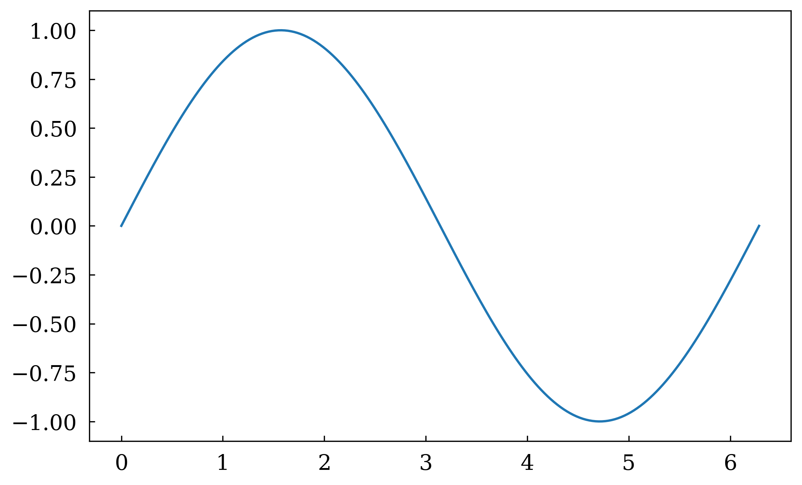
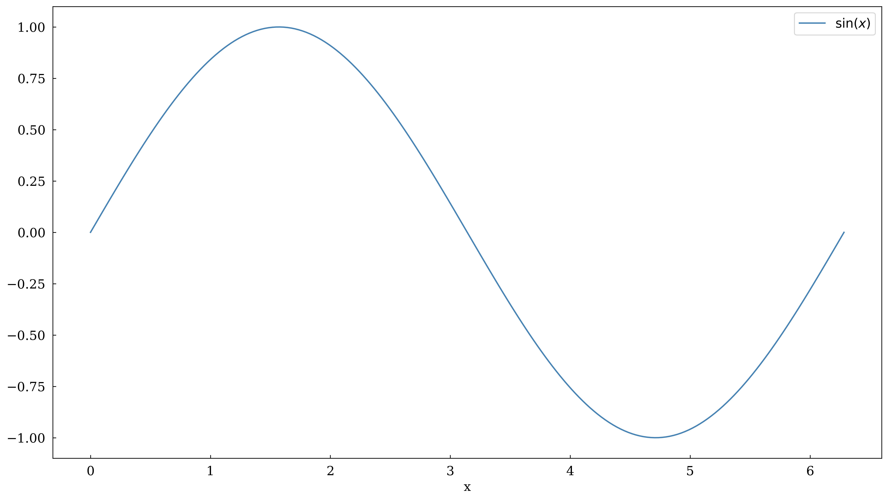
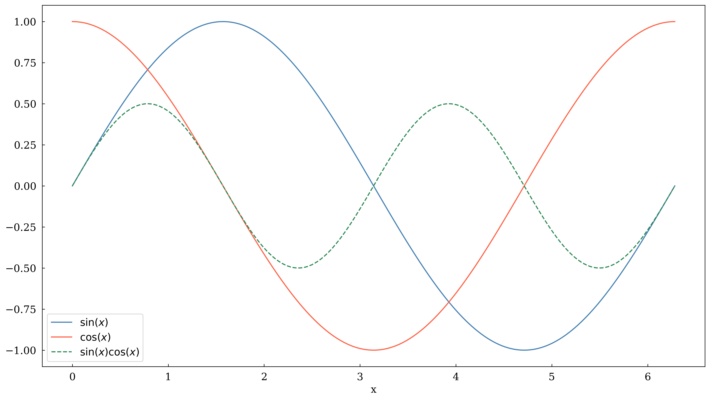

# Maxlotlib


# Maxplotlib

A clean, expressive wrapper around **Matplotlib** **tikzfigure** for
producing publication-quality figures with minimal boilerplate. Swap
backends without rewriting your data — render the same canvas as a crisp
PNG, an interactive Plotly chart, or camera-ready **TikZ** code for
LaTeX.

## Install

``` bash
pip install maxplotlibx
```

## Showcase

### Quickstart

``` python
import numpy as np
from maxplotlib import Canvas

x = np.linspace(0, 2 * np.pi, 200)
y = np.sin(x)

canvas, ax = Canvas.subplots()
ax.plot(x, y)
```

Plot the figure with the default (matplotlib) backend:

``` python
canvas.show()
```



Alternatively, plot with the TikZ backend (not done yet):

``` python
canvas.show(backend="tikzfigure")
```


### Layers

``` python
x = np.linspace(0, 2 * np.pi, 200)

canvas, ax = Canvas.subplots(width="10cm", ratio=0.55)

ax.plot(x, np.sin(x), color="steelblue", label=r"$\sin(x)$", layer=0)
ax.plot(x, np.cos(x), color="tomato", label=r"$\cos(x)$", layer=1)
ax.plot(
    x,
    np.sin(x) * np.cos(x),
    color="seagreen",
    label=r"$\sin(x)\cos(x)$",
    linestyle="dashed",
    layer=2,
)

ax.set_xlabel("x")
ax.set_legend(True)
```

Show layer 0 only, then layers 0 and 1, then everything:

``` python
canvas.show(layers=[0])
```



Show all layers:

``` python
canvas.show()
```


