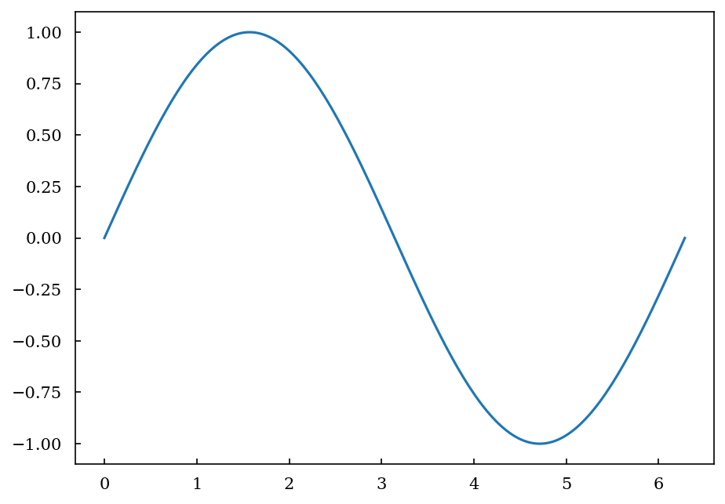
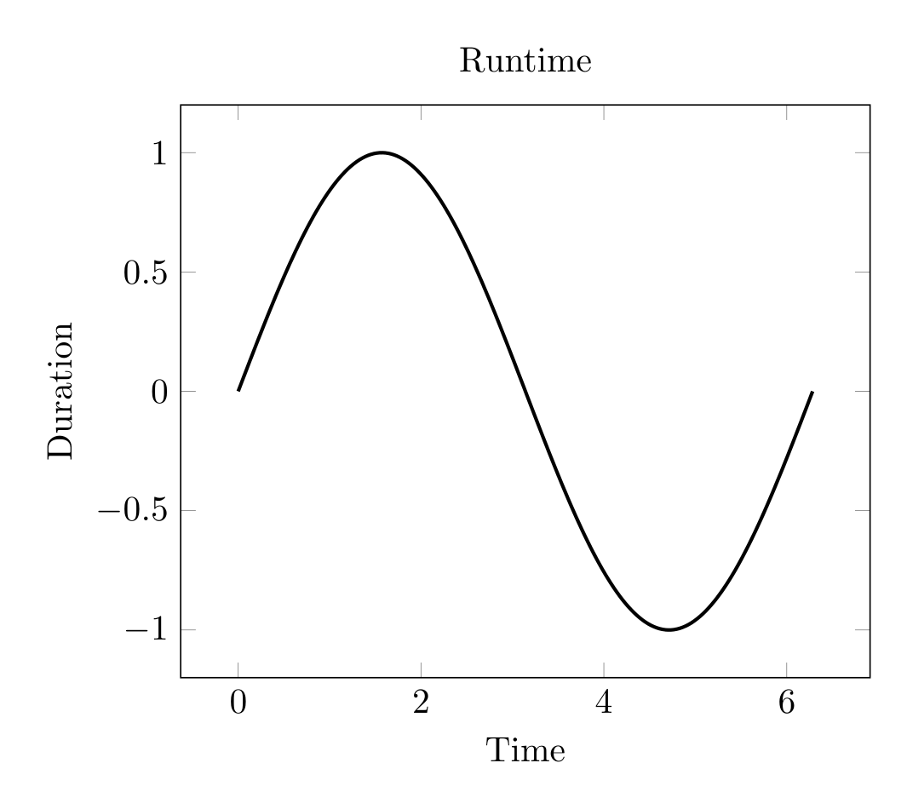
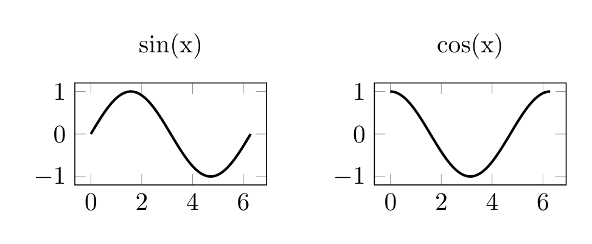
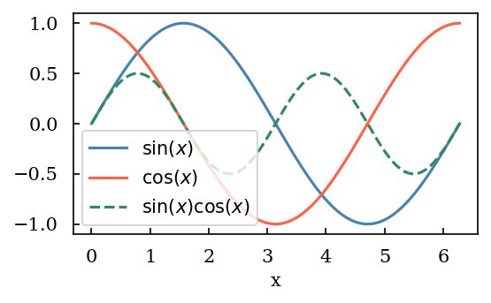

# Maxlotlib


# Maxplotlib

A clean, expressive wrapper around **Matplotlib**, **Plotly**,
**plotext**, and **tikzfigure** for producing publication-quality
figures with minimal boilerplate. Swap backends without rewriting your
data — render the same canvas as a crisp PNG, an interactive Plotly
chart, a terminal-native plotext figure, or camera-ready **TikZ** code
for LaTeX.

## Install

``` bash
pip install maxplotlibx
```

## Showcase

### Quickstart

<div id="fig-showcase-1">

``` python
import numpy as np
from maxplotlib import Canvas

x = np.linspace(0, 2 * np.pi, 200)
y = np.sin(x)

canvas, ax = Canvas.subplots()
ax.plot(x, y)
```

Figure 1

</div>

Plot the figure with the default (matplotlib) backend:

``` python
canvas.show()
```



For Matplotlib-specific customization, pass method calls declaratively.
Figure methods run once and axes methods run for every subplot,
providing access to any Matplotlib API without requiring a maxplotlib
wrapper:

``` python
canvas.plot(matplotlib_customizations={
    "figure": {
        "suptitle": "My figure",
    },
    "axes": {
        "tick_params": {
            "axis": "both",
            "which": "major",
            "length": 6,
        },
    },
})
```

For dynamic customization, the same option also accepts a function:

``` python
def customize(fig, axes):
    fig.suptitle("My figure")
    for ax in axes.flat:
        ax.tick_params(axis="both", which="major", length=6)

canvas.plot(matplotlib_customizations=customize)
```

### Axis Label and Tick Styling

Axis labels, titles, and tick appearance accept Matplotlib-style keyword
arguments:

``` python
canvas.set_xlabel("Time", fontsize=12, fontweight="bold", labelpad=10)
canvas.set_ylabel("Duration", color="darkblue")
canvas.set_title("Runtime", fontsize=14, color="navy")
canvas.tick_params(
    axis="both",
    which="major",
    labelsize=10,
    colors="darkgreen",
    length=6,
)
```

Render the same line graph directly in the terminal with the `plotext`
backend:

``` python
terminal_fig = canvas.plot(backend="plotext")
print(terminal_fig.build(keep_colors=False))
```

                                           Runtime                                  
         ┌─────────────────────────────────────────────────────────────────────────┐
     1.00┤             ▗▄▞▀▀▀▀▀▙▄▖                                                 │
         │          ▗▄▀▘         ▝▀▄                                               │
         │        ▗▞▘               ▀▄                                             │
     0.67┤       ▟▀                   ▀▄                                           │
         │     ▄▛                       ▚▖                                         │
     0.33┤   ▗▞                          ▝▄                                        │
         │  ▄▀                             ▚▖                                      │
         │▗▞▘                               ▀▄                                     │
     0.00┤▀                                  ▝▚▖                                  ▞│
         │                                     ▀▄                               ▗▞▘│
         │                                      ▝▚                             ▄▀  │
    -0.33┤                                        ▀▖                          ▞▘   │
         │                                         ▝▚                       ▟▀     │
    -0.67┤                                           ▀▄                   ▄▛       │
         │                                             ▀▄               ▗▞▘        │
         │                                               ▀▄▖         ▗▄▀▘          │
    -1.00┤                                                 ▝▀▜▄▄▄▄▄▞▀▘             │
         └┬─────────────────┬─────────────────┬─────────────────┬─────────────────┬┘
         0.0               1.6               3.1               4.7              6.3 
    Duration                                Time                                    

Or plot with the TikZ backend:

``` python
canvas.show(backend="tikzfigure")
```



### Horizontal Subplots with TikZ Backend

The tikzfigure backend supports creating side-by-side subplots (1×n
layouts):

``` python
x = np.linspace(0, 2 * np.pi, 200)
canvas, (ax1, ax2) = Canvas.subplots(ncols=2, width="10cm", ratio=0.3)

ax1.plot(x, np.sin(x), color="royalblue")
ax1.set_title("sin(x)")

ax2.plot(x, np.cos(x), color="tomato")
ax2.set_title("cos(x)")

canvas.suptitle("Trigonometric Functions")
canvas.show(backend="tikzfigure")  # Generates LaTeX subfigures
```

<div id="fig-showcase-subplots">



Figure 2

</div>

**Note:** Only horizontal layouts (1×n) are currently supported with the
tikzfigure backend. Vertical/grid layouts will raise
`NotImplementedError`. See the tutorials for more examples.

### Terminal Backend with plotext

The `plotext` backend is designed for terminal-first workflows. It
currently supports line plots, scatter plots, bars, filled regions,
error bars, reference lines, text/annotations, labels/titles, log axes,
layers, matrix-style `imshow()` rendering, common patches, and
multi-subplot canvases.

``` python
x = np.linspace(1, 10, 40)

canvas, ax = Canvas.subplots()
ax.plot(x, np.sqrt(x), color="cyan", label="sqrt(x)")
ax.errorbar(x[::8], np.sqrt(x[::8]), yerr=0.15, color="yellow", label="samples")
ax.set_title("Terminal plot")
ax.set_xlabel("x")
ax.set_ylabel("y")
ax.set_xscale("log")
ax.set_legend(True)

canvas.show(backend="plotext")
```

                                        Terminal plot                               
        ┌──────────────────────────────────────────────────────────────────────────┐
    3.16┤ ▞▞ sqrt(x)                                                             ▄▞│
        │                                                                   │▗▄▞▀  │
        │                                                                  ▄┼▘     │
    2.79┤                                                               ▄▀▀        │
        │                                                            ┼▀▀           │
    2.42┤                                                        ▗▞▀▀│             │
        │                                                    ▗▞▀▀▘                 │
        │                                               ▗▄┼▄▀▘                     │
    2.04┤                                            ▗▄▀▘ │                        │
        │                                        ▗▄▞▀▘                             │
        │                                 │  ▄▄▀▀▘                                 │
    1.67┤                              ▗▄▄┼▀▀                                      │
        │                        ▗▄▄▞▀▀▘                                           │
    1.30┤                 ▄▄▄▄▀▀▀▘                                                 │
        │            ▄▄▞▀▀                                                         │
        │┼  ▗▄▄▞▀▀▀▀▀                                                              │
    0.93┤│▀▀▘                                                                      │
        └┬─────────────────┬──────────────────┬─────────────────┬─────────────────┬┘
        1.0               1.8                3.2               5.6             10.0 
    y                                         x                                     

    <maxplotlib.backends.plotext.figure.PlotextFigure at 0x1102cd310>

### Layers

<div id="fig-showcase-2">

``` python
x = np.linspace(0, 2 * np.pi, 200)

canvas, ax = Canvas.subplots(width="10cm", ratio=0.55)

ax.plot(x, np.sin(x), color="steelblue", label=r"$\sin(x)$", layer=0)
ax.plot(x, np.cos(x), color="tomato", label=r"$\cos(x)$", layer=1)
ax.plot(
    x,
    np.sin(x) * np.cos(x),
    color="seagreen",
    label=r"$\sin(x)\cos(x)$",
    linestyle="dashed",
    layer=2,
)

ax.set_xlabel("x")
ax.set_legend(True)
```

Figure 3

</div>

Show layer 0 only, then layers 0 and 1, then everything:

``` python
canvas.show(layers=[0])
```


    (<Figure size 590.551x324.803 with 1 Axes>,
     array([[<Axes: xlabel='x'>]], dtype=object))

Show all layers:

``` python
canvas.show()
```



    (<Figure size 590.551x324.803 with 1 Axes>,
     array([[<Axes: xlabel='x'>]], dtype=object))
